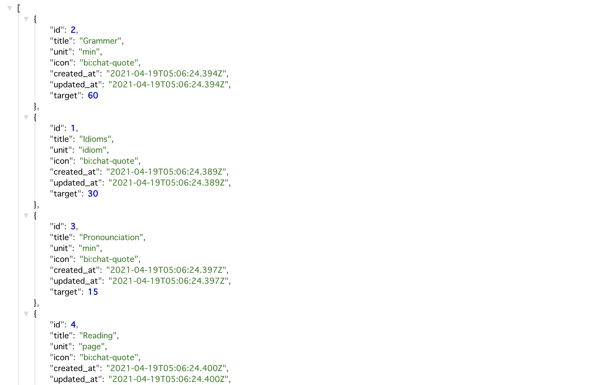

# 📦 Tracking App API – Ruby on Rails RESTful Backend

A structured REST API that powers the **Tracking App** — enabling clear, customizable daily habit tracking with secure user management.



---

## 🧭 About the Project

**Tracking App API** is the Rails-based backend for the fullstack **Tracking App**. It provides a RESTful interface to manage users, categories (items), and daily progress records.

Developed as a Microverse capstone, this API was designed to support an intuitive, low-friction UX on the frontend — handling structured data and authentication cleanly to reduce user confusion and support real-world use.

🔗 Frontend repo: [Tracking App with React & Redux](https://github.com/yoko-vicky/Tracking-App-with-React-Redux)

---

## 🧠 API Design Highlights

- RESTful architecture for predictable integration with frontend needs
- Secure authentication using JWT to support stateless session handling from React
- CORS setup for seamless frontend–backend communication
- Defined clear JSON responses to support React + Redux state management
- Designed endpoints to minimize client-side data processing and ensure reliable UX flows
- Admin mode for managing trackable categories
- Structured, relational Postgres database supporting customizable categories and efficient user-specific record retrieval

This project reflects my approach to **clarifying data flows and supporting usable interfaces** through well-organized backend design.

---

## 🚀 Key Features

- 🔐 User authentication with JWT
- 👥 Role-based access (user vs admin)
- 📊 CRUD for daily progress records
- 🗂 Admin management of tracking categories (items)
- 🌐 CORS-configured for frontend integration

Frontend app for this API:  
🔗 [Tracking App with React & Redux](https://github.com/yoko-vicky/Tracking-App-with-React-Redux)

---

## 🛠️ Built With

- [Ruby on Rails](https://rubyonrails.org/)
- [PostgreSQL](https://www.postgresql.org/)
- [JWT](https://jwt.io/)
- [Rack-cors](https://github.com/cyu/rack-cors)

---

## ⚙️ Getting Started

To run locally:

```bash
git clone https://github.com/yoko-vicky/Tracking-App-Api-with-Rails
cd Tracking-App-Api-with-Rails
bundle install
rails db:setup
rails server
```
To run tests:
```
rspec
```
---

## 👥 Usage

### As a User
- Sign up or log in with your username and password.
- Receive a JWT token for secure access.
- Use the token in your Authorization headers when sending requests:
```json
Authorization: Bearer {your_token}
```
- View and manage your daily tracking records.

---

### As an Admin
- Admin accounts can manage the items (categories to track).
- Admin user creation example in Rails console:
```ruby
User.create(username: 'admin', password: 'admin', admin: true)
```
- By default, running rails `db:setup` seeds an admin user.

---

## 🔗 Frontend Integration
This API is designed to work seamlessly with the frontend React app.
For local development:
1. Update the puma.rb port if needed (e.g., 3001).
2. Adjust CORS settings in cors.rb for your frontend origin.

Example CORS configuration:
```ruby
origins 'http://localhost:3000'
```

---

## ✨ Database Structure

**Tables and Models:**

- **Users**: username, password_digest, admin (boolean)
- **Items**: title, unit, icon, target
- **Records**: date, result, item_id, user_id

The relational schema was designed to support customizable categories and efficient user-specific record retrieval, enabling clear, filterable history views in the UI.

---

## 👤 Author

**Yoko Saka**  
UX-Focused Frontend Developer × Backend Integration

- GitHub: [@yoko-vicky](https://github.com/yoko-vicky)
- LinkedIn: [Yoko Saka](https://www.linkedin.com/in/yoko-vicky/)
- Portfolio: [View My Work](https://www.yokoworks.dev/)

---

## 🤝 Contributing

1. Fork the repo  
2. Create your feature branch (`git checkout -b feature/AmazingFeature`)  
3. Commit your changes (`git commit -m 'Add some AmazingFeature'`)  
4. Push to the branch (`git push origin feature/AmazingFeature`)  
5. Open a Pull Request

---

## ⭐️ Support

If you found this useful or inspiring, please give it a ⭐️!

---

## 📝 License

**Application:** MIT License

---

## 🙏 Acknowledgements

- [Ruby on Rails Guides](https://guides.rubyonrails.org/api_documentation_guidelines.html)
- [JWT](https://jwt.io/)
- [Rack-cors](https://github.com/cyu/rack-cors)
- [Bcrypt](https://github.com/kelektiv/node.bcrypt.js#readme)
- [Shoulda-matchers](https://github.com/thoughtbot/shoulda-matchers)
- [Rspec-rails](https://github.com/rspec/rspec-rails)


